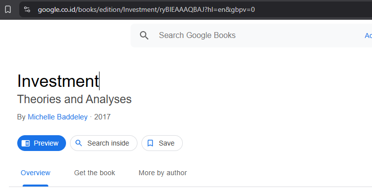

# Books

## Fachrio Raditya

Flutter Project Praktikum Pemrograman Asynchronous Semester 6

## Praktikum 1

- Soal 1

  

- Soal 2
  
  

- Soal 3

Penjelasan Kode

Bagian dari aplikasi Flutter yang menggunakan tombol untuk memicu pengambilan data. Ketika tombol ditekan, status aplikasi diubah menjadi 'Loading...' dan fungsi `getData()` dipanggil. Setelah data berhasil diambil, hasilnya ditampilkan, tetapi hanya 450 karakter pertama. Jika terjadi kesalahan saat pengambilan data, pesan kesalahan akan ditampilkan.

## Praktikum 2

- Soal 4

Penjelasan Kode

Mendefinisikan beberapa fungsi asinkron yang mengembalikan nilai setelah penundaan. Fungsi `count()` memanggil ketiga fungsi tersebut secara berurutan, menjumlahkan hasilnya, dan memperbarui status aplikasi dengan total yang dihitung.

## Praktikum 3

- Soal 5

Penjelasan Kode

Menggunakan `Completer` untuk mengelola operasi asinkron. Fungsi `getNumber()` menginisialisasi `Completer` dan memanggil fungsi `calculate()`, yang akan menyelesaikan `Completer` setelah penundaan 5 detik dengan mengembalikan nilai 42.

- Soal 6

Penjelasan Kode

Perbedaan calculate dengan calculate 2 hanya dilengkapi dengan penanganan kesalahan. Jika terjadi kesalahan selama penundaan, `Completer` akan diselesaikan dengan error.

Fungsi `getNumber()` memanggil salah satu dari fungsi di atas dan menangani hasilnya. Jika berhasil, hasilnya akan ditampilkan; jika terjadi kesalahan, pesan kesalahan akan ditampilkan.

## Praktikum 4

- Soal 7

- Soal 8

### Perbedaan antara `FutureGroup` dan `Future.wait`

- **FutureGroup**: Memungkinkan penambahan fungsi asinkron secara dinamis dan menunggu hingga semua fungsi selesai. Cocok untuk situasi di mana jumlah fungsi asinkron tidak diketahui sebelumnya.
- **Future.wait**: Mengharuskan daftar fungsi asinkron yang sudah ditentukan sebelumnya dan mengembalikan hasilnya sebagai daftar setelah semua fungsi selesai. Lebih sederhana untuk digunakan ketika jumlah fungsi sudah diketahui.

## Praktikum 5

- Soal 9

- Soal 10

### Perbedaan antara `returnError` dan `handleError`

- **returnError**: Fungsi ini hanya mensimulasikan kesalahan dengan melempar exception setelah penundaan. Tidak ada penanganan kesalahan di dalamnya.
- **handleError**: Fungsi ini menangani kesalahan yang mungkin terjadi saat memanggil `returnError`. Dengan menggunakan blok `try-catch`, fungsi ini dapat menangkap dan mengelola kesalahan, serta memastikan bahwa bagian `finally` selalu dieksekusi.

## Praktikum 6

- Soal 11

- Soal 12

### Pengambilan Koordinat GPS di Browser

Saat kita menjalankan aplikasi dibrowser mendapatkan koordinat GPS karena browser modern mendukung API Geolocation. Ketika aplikasi meminta izin untuk mengakses lokasi, browser akan menampilkan dialog untuk meminta izin dari pengguna. Jika pengguna memberikan izin, browser akan menggunakan informasi lokasi perangkat (jika tersedia) untuk memberikan koordinat GPS.

## Praktikum 7

- Soal 13
  Tidak terlalu signifikan untuk UI hanya saja tidak membutuhkan akses idzin location, dan menunggu selama 3 detik untuk mendapatkan connection location jika tidak maka akan muncul No Data.

